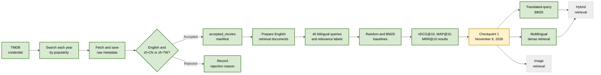

# Multilingual Audiovisual Media Retrieval

This project studies cross-lingual retrieval of English media metadata from multilingual queries: a user describes a movie in Chinese or English (Spanish planned), and the system searches an English-only catalog. Image queries are also in scope. We compare lexical retrieval, translated-query retrieval, and multilingual semantic retrieval, all scored with the same queries, relevance labels, and evaluation script.

The index deliberately stays English. Indexing the stored Chinese translations would turn the task into same-language retrieval and remove the cross-lingual problem, so each method instead changes how the query reaches the English index.

## Current Scope

- **Query languages:** English and Chinese first. Spanish queries may be added later. Because documents stay in English, a new language needs only new queries, not a new index. The saved TMDB responses already contain Spanish translations for most movies (about 64% in a 300-movie sample), so no extra collection is needed to write Spanish queries.
- **Image queries:** in scope. A user submits a movie image and the system returns matching titles. Backdrops or screenshots are preferred over posters as queries, because a poster query would trivially match the identical poster in the collection.
- **Query set:** the 40 bilingual queries in `data/evaluation/checkpoint/` are the official evaluation set. The set will be expanded later.

The current work focuses on building the document collection from The Movie Database (TMDB). The collection script is implemented for movies. TV series will be added through the corresponding TMDB TV endpoints. Animation will be identified using TMDB genre ID `16`; it may be either a movie or a television series.

## Data Selection

TMDB does not provide a discovery filter for translation availability. The script therefore searches for candidate movies, requests the complete metadata for each candidate, and then checks its translations.

Movies are searched one release year at a time. Within each year, results are sorted by popularity because widely viewed titles are more likely to contain complete translations. A movie is included in the bilingual collection when it has:

- a nonempty English title;
- a nonempty English overview; and
- a `zh-CN` or `zh-TW` translation containing both a title and an overview.

The target count refers to movies that pass these conditions, not the number of candidates examined. The script may need to inspect substantially more than 5,000 candidates to collect 5,000 qualifying movies.

## Collection Pipeline


```mermaid
flowchart LR
    A["TMDB<br/>credential"] --> B["Search each year<br/>by popularity"]
    B --> C["Fetch and save<br/>raw metadata"]
    C --> D{"English and<br/>zh-CN or zh-TW?"}
    D -->|"Accepted"| E["accepted_movies<br/>manifest"]
    D -->|"Rejected"| R["Record<br/>rejection reason"]
    E --> F["Prepare English<br/>retrieval documents"]
    F --> G["40 bilingual queries<br/>and relevance labels"]
    G --> H["Random and BM25<br/>baselines"]
    H --> I["nDCG@10, MAP@10,<br/>MRR@10 results"]
    I --> J["Checkpoint 1<br/>November 9, 2026"]
    J --> K["Translated-query<br/>BM25"]
    J --> M["Multilingual<br/>dense retrieval"]
    K --> N["Hybrid<br/>retrieval"]
    M --> N
    J --> L["Image<br/>retrieval"]

    classDef completed fill:#d9ead3,stroke:#38761d,stroke-width:2px,color:#000000;
    classDef checkpoint fill:#fff2cc,stroke:#bf9000,stroke-width:2px,color:#000000;
    classDef planned fill:#eeeeee,stroke:#999999,stroke-width:1px,stroke-dasharray:4 3,color:#000000;
    class A,B,C,D,E,F,R,G,H,I,K,M completed;
    class J checkpoint;
    class N,L planned;
```

Green blocks are implemented and tested; grey dashed blocks are planned. The collection contains 5,000 movies released 2024–2026. The baselines, translated-query BM25, and multilingual dense retrieval have been evaluated on all 40 queries.

Raw candidate metadata is retained even when a movie does not pass the bilingual filter. This allows the collection process to be audited and resumed without requesting the same details again.

## Data Preprocessing

The TMDB detail responses are source data rather than retrieval documents. They contain nested credits, translations, image records, release information, and other fields that should not all be placed in the search index. Preprocessing converts each accepted raw response into one consistent document while leaving the original JSON unchanged.

The preprocessing script performs the following steps:

1. Read the IDs and raw-file locations from `accepted_movies.json`.
2. Validate the raw JSON and confirm that its TMDB ID matches the manifest.
3. Extract the English title, overview, genres, keywords, top cast, directors, writers, release year, and media type.
4. Preserve Chinese translations and display fields such as poster and backdrop paths.
5. Combine only the selected English fields into `retrieval_text` for BM25.
6. Write processed documents, collection statistics, and any exclusion reasons.

Chinese translations are stored for query preparation and a future interface, but they are not added to `retrieval_text`. This keeps the retrieval task Chinese query to English document.

A small number of documents still contain Chinese characters in `retrieval_text` (67 of 5,000). These come from TMDB's English data itself, which leaves some cast, writer, and keyword values for Chinese-language films unromanized. They are rare and only match a query containing the exact name.

## Setup

Create a virtual environment and install the Python dependencies. On a machine without a GPU, install the CPU build of PyTorch first:

```powershell
python -m venv .venv
.venv\Scripts\python -m pip install torch --index-url https://download.pytorch.org/whl/cpu
.venv\Scripts\python -m pip install -r requirements.txt
```

Run the scripts with `.venv\Scripts\python`. The translation and embedding models download from Hugging Face on first use. Encoding the collection needs several GB of free memory.

Create a `.env` file in the project folder:

```dotenv
TMDB_READ_TOKEN=your_api_read_access_token
```

The `.env` file contains a credential and must not be committed to GitHub.

## Running the Collector

Test the pipeline with 20 qualifying movies from 2025:

```powershell
python collect_tmdb_movies.py --target 20 --start-year 2025 --end-year 2025
```

Collect up to 5,000 qualifying movies across release years:

```powershell
python collect_tmdb_movies.py `
  --target 5000 `
  --start-year 2026 `
  --end-year 1900 `
  --cutoff-date 2026-11-08
```

The collector saves each API response as it is received. If the program is interrupted, running the same command again reuses valid files already stored on disk. Previously accepted IDs are reconstructed from the saved metadata, so increasing the target from 20 to 5,000 does not create duplicate documents.

## Output Structure

```text
project_proposal/
├── .env
├── .gitignore
├── requirements.txt
├── collect_tmdb_movies.py
├── prepare_tmdb_documents.py
├── test_tmdb_api.py
└── data/
    ├── raw/                         # Original newest-to-oldest pilot collection
    ├── bilingual_movies/
    │   ├── accepted_movies.json     # IDs and basic information for accepted movies
    │   ├── collection_summary.json  # Counts, settings, failures, and rejection reasons
    │   └── raw/
    │       ├── discover/
    │       │   └── movie/
    │       │       ├── year_2026/
    │       │       └── year_2025/
    │       └── details/
    │           └── movie/
    │               ├── 123.json
    │               └── 456.json
    ├── processed/
    │   ├── documents.jsonl
    │   ├── collection_statistics.json
    │   └── excluded_documents.jsonl
    ├── evaluation/
    │   ├── checkpoint/
    │   │   ├── queries_40_bilingual.csv       # 20 English/Chinese query pairs
    │   │   ├── queries_translated.csv         # Machine-translated English version of each query
    │   │   ├── human_relevance_judgments.csv  # 50 judged documents per query
    │   │   └── baseline_results.csv           # Per-query metrics for BM25 and Random
    │   └── results/
    │       └── method_comparison.csv          # Per-query metrics for all methods
    └── indexes/                               # Cached document vectors (gitignored)
```

The retrieval and evaluation scripts sit alongside the collection scripts in the project folder:

| Script | Purpose |
|---|---|
| `baseline_retrieval.py` | BM25 and Random baselines |
| `translate_queries.py` | Translates non-English queries into English |
| `dense_retrieval.py` | Multilingual dense retrieval |
| `evaluate_checkpoint.py` | Scores any combination of methods |
| `prepare_evaluation.py` | Example of building the judging pool |

`accepted_movies.json` is an index of qualifying records. The complete metadata remains under `raw/details/movie/`. Image paths and video references are stored as metadata, but the associated media files are not downloaded during this stage.

## Running Preprocessing

After the collection finishes, convert the accepted raw records into normalized documents:

```powershell
python prepare_tmdb_documents.py
```

For a small test, process only the first five accepted movies:

```powershell
python prepare_tmdb_documents.py --limit 5
```

`documents.jsonl` contains one processed movie per line. The English `retrieval_text` field is intended for the first BM25 index. Chinese translations, poster paths, ratings, and provenance fields remain available for query preparation and interface development but are not included in the retrieval text.

## Evaluation Set

`queries_40_bilingual.csv` contains 20 query groups. Each group has one English query and one Chinese query (Traditional characters) expressing the same information need, so results can be compared across languages on identical needs.

| Type | English | Chinese | Relevance |
|---|---|---|---|
| Known-item | 10 | 10 | The single movie in `target_doc_id` |
| Exploratory | 10 | 10 | Graded human labels, 1–5 |

For every query, 50 candidate documents were pooled from BM25 results for the query, BM25 results for its English pair, and random documents. Each candidate was labelled 1–5 by hand in `human_relevance_judgments.csv`. A label of 4 or 5 counts as relevant for MAP.

`prepare_evaluation.py` shows the pooling approach but does not reproduce the committed pool exactly: the committed file also pools the paired English query's BM25 results and uses different column names. The script that produced the committed pool still needs to be added.

## Baseline Retrieval

`baseline_retrieval.py` implements two baselines over the English `retrieval_text` field:

- **BM25** with an inverted index, `k1 = 1.2`, `b = 0.75`, and lowercase word tokenization.
- **Random**, a reproducible shuffle of the collection.

Search from the command line:

```powershell
python baseline_retrieval.py --query "a robot stranded on an island" --method bm25 --top_k 10
```

## Cross-Lingual Methods

Both methods leave the English index unchanged and differ only in how the query reaches it.

### Translated-query BM25

`translate_queries.py` translates each Chinese query into English with the offline MarianMT model `Helsinki-NLP/opus-mt-zh-en` and saves the result to `queries_translated.csv`. English queries are copied unchanged. Translating once and saving keeps evaluation fast and reproducible, and the translations can be inspected. At search time the saved English text is run through the existing BM25 index.

```powershell
.venv\Scripts\python translate_queries.py
```

### Multilingual dense retrieval

`dense_retrieval.py` uses `intfloat/multilingual-e5-base`, which maps text in about 100 languages into one shared 768-dimensional vector space. Each document is encoded once with the prefix `passage: ` and cached in `data/indexes/`. A query is encoded with the prefix `query: `, and documents are ranked by cosine similarity. The Chinese query is never translated.

Two document text modes are available:

| Mode | Fields embedded |
|---|---|
| `full` | The same `retrieval_text` that BM25 indexes, including cast, director, and writer names |
| `plot` (default) | Title, overview, tagline, genres, and keywords only |

The model averages its token vectors into one document vector, so every field dilutes the others. In `full` mode the name lists make up a large share of each vector and carry a strong language signal: Chinese queries returned Chinese-language films 68% of the time, although they make up 7% of the collection. The `plot` mode reduced this to 38% and improved accuracy in both languages. Its trade-off is that queries about people, such as "movies directed by Christopher Nolan", cannot match through names.

```powershell
.venv\Scripts\python dense_retrieval.py --query "一個機器人困在荒島上" --text_mode plot
```

## Running the Evaluation

Score the original baselines:

```powershell
python evaluate_checkpoint.py
```

Compare all methods:

```powershell
.venv\Scripts\python evaluate_checkpoint.py `
  --methods bm25,random,bm25_translated,dense_full,dense_plot `
  --out data/evaluation/results/method_comparison.csv
```

The script evaluates only queries whose 50 candidates are all labelled, writes per-query metrics to the output file, and prints means overall and by language and query type.

New methods retrieve documents outside the judged pool. Unjudged documents are scored as not relevant, which is standard for pooled evaluation, and the `judged_at_10` column records how many of each top 10 were labelled. When it is low, nDCG@10 and MAP@10 underestimate that method. MRR@10 is unaffected because it checks only the known target.

| Metric | Queries | What it measures |
|---|---|---|
| nDCG@10 | All | Ranking quality against the graded 1–5 labels (main metric) |
| MAP@10 | All | Precision at each relevant (4–5) result in the top 10 |
| MRR@10 | Known-item | How high the target movie appears; 0 if it is outside the top 10 |

MRR@10 uses only `target_doc_id`. Similar movies that were labelled 4 or 5 do not count, which matches the proposal's definition of known-item relevance. All metrics are computed against the judged pool rather than the full collection.

## Checkpoint Results

| Queries | Method | nDCG@10 | MAP@10 | MRR@10 |
|---|---|---|---|---|
| English known-item | BM25 | 0.860 | 0.724 | 0.950 |
| English exploratory | BM25 | 0.752 | 0.397 | — |
| Chinese known-item | BM25 | 0.000 | 0.000 | 0.000 |
| Chinese exploratory | BM25 | 0.000 | 0.000 | — |
| All 40 queries | BM25 | 0.403 | 0.280 | 0.475 |
| All 40 queries | Random | 0.012 | 0.003 | 0.000 |

BM25 works well for English queries and returns nothing for Chinese queries. The index contains only English text, and the tokenizer treats a run of Chinese characters as a single token, so Chinese queries share no terms with any document. Closing this gap is the purpose of the cross-lingual methods. Report the per-language rows alongside the overall figures, because the overall mean hides the gap.

## Method Comparison Results

All five methods on the same 40 queries. Known-item rows use MRR@10; exploratory rows use nDCG@10.

| Queries | BM25 | BM25 + translation | Dense (full) | Dense (plot) | Random |
|---|---|---|---|---|---|
| English known-item (MRR@10) | 0.950 | 0.950 | 0.731 | 0.900 | 0.000 |
| Chinese known-item (MRR@10) | 0.000 | **0.920** | 0.249 | 0.670 | 0.000 |
| English exploratory (nDCG@10) | 0.752 | 0.752 | 0.230* | 0.301* | 0.014 |
| Chinese exploratory (nDCG@10) | 0.000 | **0.483** | 0.090* | 0.145* | 0.024 |

\* Fewer than 4 of each top 10 were judged, so these values underestimate the method.

English rows are identical for BM25 and BM25 + translation because English queries are not translated.

Findings so far:

- **Translated-query BM25 is the strongest method.** It ranks 9 of 10 Chinese known-item targets first, close to English performance, and shows no language bias.
- **Dense retrieval works without translation but trails it.** With plot-only text it ranks 6 of 10 Chinese targets first and 8 of 10 in the top 10. Its two clear failures, *Anora* (rank 39) and *A Minecraft Movie* (rank 23), depend on specific cultural or wording cues.
- **Document text matters for dense retrieval.** Removing person names raised Chinese known-item MRR from 0.25 to 0.67 and English from 0.73 to 0.90.
- **A language bias remains.** Chinese queries still return Chinese-language films 38% of the time with plot-only dense retrieval, against 6% for translated-query BM25.
- **The exploratory comparison is unresolved.** Dense results are mostly unjudged, so labels are needed before drawing conclusions.
- **Each group has only 10 queries,** so one query moves MRR by up to 0.1. Large differences are reliable; differences under about 0.1 are not.

## Next Steps

Each new method plugs into the same evaluation: it takes a query, returns a top-10 list, and is scored by `evaluate_checkpoint.py` with the existing labels.

1. **Hybrid retrieval:** combine translated-query BM25 and dense scores. The two methods fail in different ways, and the hybrid also restores name matching that plot-only dense retrieval drops.
2. **Judge new results:** label the dense method's unjudged top-10 documents so exploratory scores become reliable.
3. **Reduce the remaining language bias:** try dropping non-English keywords from plot text, or a stronger model such as BGE-M3.
4. **Image retrieval:** download backdrop and poster images, index them with an image–text model such as CLIP, and create a small set of image queries.
5. **More queries:** expand the evaluation set, including Spanish queries, once the pipeline is stable.

## Planned Collection Extension

The next collection step will add television series using `/discover/tv` and `/tv/{series_id}`. Each normalized record will use a composite identifier such as `movie:129` or `tv:1399` so movie and TV identifiers cannot conflict. Records with genre ID `16` will be marked with `is_animation: true` rather than treated as a separate TMDB media type.
